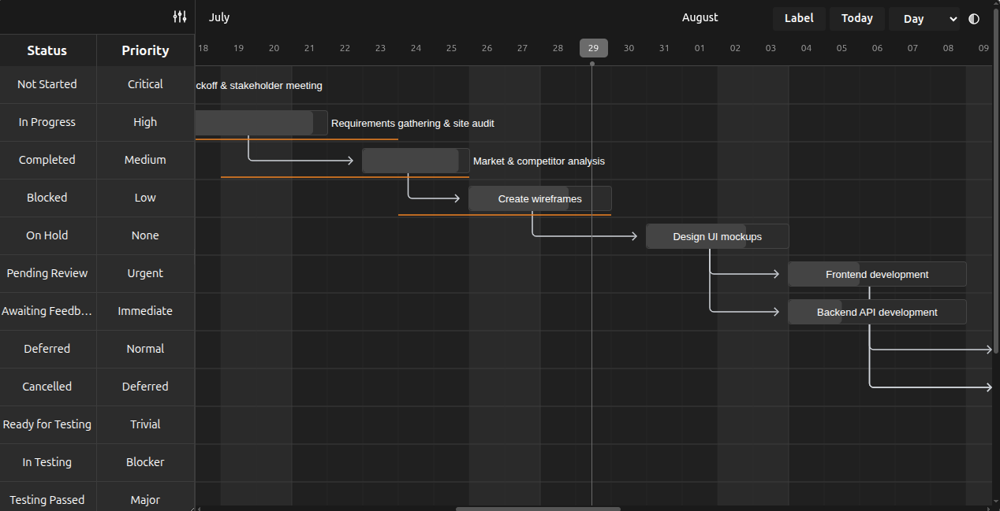

**A lightweight, modern, and interactive Gantt chart library for building project timelines on the web.**
</div>



[](https://www.jsdelivr.com/package/npm/ganttflow)

## Advanced Gantt Chart
This is an enhanced Gantt chart library with additional features including a comprehensive label system, improved view mode switching, and enhanced user experience. 

Gantt charts are bar charts that visually illustrate a project's tasks, schedule, and dependencies. With this enhanced Gantt library, you can build beautiful, customizable Gantt charts with advanced labeling capabilities and improved usability.

You can use it anywhere from hobby projects to tracking the goals of your team at the worksplace.

### Key Features
- **Advanced Label System**: Display task metadata in a resizable side panel column filtering.
- **Theme Toggle**: Built-in theme switcher with Auto, Light, and Dark modes that respects system preferences.
- **Enhanced View Modes**: Improved view mode switching that maintains focus on current date across different time scales
- **Customizable Views**: customize the timeline based on various time periods - day, hour, or year, you have it. You can also create your own views.
- **Ignore Periods**: exclude weekends and other holidays from your tasks' progress calculation.
- **Configure Anything**: spacing, edit access, labels, you can control it all. Change both the style and functionality to meet your needs.
- **Multi-lingual Support**: suitable for companies with an international base.
- **Enhanced UX**: Better scrolling behavior, improved accessibility, and more responsive interactions.

## Usage

Install with:
```bash
npm i ganttflow
```

Or from the CDN:
```html
<script src="https://cdn.jsdelivr.net/npm/ganttflow/dist/gantt.umd.js"></script>
<link rel="stylesheet" href="https://cdn.jsdelivr.net/npm/ganttflow/dist/gantt.css">
```

Start using Gantt:
```js
let tasks = [
  {
    id: '1',
    name: 'Redesign website',
    start: '2016-12-28',
    end: '2016-12-31',
    expected_start: '2016-12-24',
    expected_end: '2016-12-31',
    progress: 20
  },
  ...
]
let gantt = new Gantt("#gantt", tasks);
```

### Configuration
The Enhanced Gantt Chart offers a wide range of options to customize your chart.


| **Option**               | **Description**                                                                 | **Possible Values**                                 | **Default**                        |
|---------------------------|---------------------------------------------------------------------------------|----------------------------------------------------|------------------------------------|
| `arrow_curve`            | Curve radius of arrows connecting dependencies.                                        | Any positive integer.                              | `5`                                |
| `auto_move_label`        | Move task labels when user scrolls horizontally.                                 | `true`, `false`                                    | `false`                            |
| `bar_corner_radius`      | Radius of the task bar corners (in pixels).                                         | Any positive integer.                              | `3`                                |
| `bar_height`             | Height of task bars (in pixels).                                                 | Any positive integer.                              | `30`                               |
| `container_height`       | Height of the container.                                                       | `auto` - dynamic container height to fit all tasks - _or_ any positive integer (for pixels).            | `auto`                           |
| `column_width`           | Width of each column in the timeline.                                          | Any positive integer.                  | 45                             |
| `date_format`            | Format for displaying dates.                                                   | Any valid JS date format string.                     | `YYYY-MM-DD`                     |
| `upper_header_height`    | Height of the upper header in the timeline (in pixels).                                     | Any positive integer.                              | `45`                               |
| `lower_header_height`    | Height of the lower header in the timeline (in pixels).                                     | Any positive integer.                              | `30`                               |
| `snap_at`                | Snap tasks at particular intervel while resizing or dragging.                                              | Any _interval_ (see below)                  | `1d`                             |
| `infinite_padding`       | Whether to extend timeline infinitely when user scrolls.                                   | `true`, `false`                                    | `true`                             |
| `holidays`               | Highlighted holidays on the timeline.                                           | Object mapping CSS colors to holiday types. Types can either be a) 'weekend', or b) array of _strings_ or _date objects_ or _objects_ in the format `{date: ..., label: ...}`          | `{ 'var(--g-weekend-highlight-color)': 'weekend' }` |
| `ignore`                 | Ignored areas in the rendering                  | `weekend` _or_ Array of strings or date objects (`weekend` can be present to the array also).                      | `[]`                               |
| `language`               | Language for localization.                                                     | ISO 639-1 codes like `en`, `fr`, `es`.            | `en`                             |
| `lines`                  | Determines which grid lines to display.                                   | `none` for no lines, `vertical` for only vertical lines, `horizontal` for only horizontal lines, `both` for complete grid.      | `both`                           |
| `move_dependencies`      | Whether moving a task automatically moves its dependencies.                                   | `true`, `false`                                    | `true`                             |
| `padding`                | Padding around task bars (in pixels).                                                | Any positive integer.                              | `18`                               |
| `popup_on`               | Event to trigger the popup display.                                             | `click` _or_ `hover`     | `click`                          |
| `readonly_progress`      | Disables editing task progress.                                                 | `true`, `false`                                    | `false`                            |
| `readonly_dates`         | Disables editing task dates.                                                    | `true`, `false`                                    | `false`                            |
| `readonly`               | Disables all editing features.                                                  | `true`, `false`                                    | `false`                            |
| `scroll_to`              | Determines the starting point when chart is rendered.                                           | `today`, `start`, `end`, or a date string.  | `today`                          |
| `show_expected_progress` | Shows expected progress for tasks.                                              | `true`, `false`                                    | `false`                            |
| `expected_date_line`     | Shows a vertical line indicating expected completion date.                      | `true`, `false`                                    | `false`                            |
| `expected_line_button`   | Adds a button to toggle expected date lines on/off.                           | `true`, `false`                                    | `false`                            |
| `today_button`           | Adds a button to navigate to today's date.                                      | `true`, `false`                                    | `true`                             |
| `label_button`           | Adds a button to toggle the label panel visibility.                            | `true`, `false`                                    | `false`                            |
| `label_filter`           | Enables filtering/selection of label columns in the label panel.               | `true`, `false`                                    | `false`                            |
| `view_mode`              | The initial view mode of the Gantt chart.                                          | `Day`, `Week`, `Month`, `Year`.           | `Day`                            |
| `view_mode_select`       | Allows selecting the view mode from a dropdown.                                 | `true`, `false`                                    | `false`                            |

Apart from these ones, three options - `popup`,`view_modes` and `labels` (plural, not singular) - are available. They have "sub"-APIs, and thus are listed separately.

#### View Mode Configuration
The `view_modes` option determines all the available view modes for the chart. It should be an array of objects.

Each object can have the following properties:
- `name` (string) - the name of view mode.
- `padding` (interval) - the time above.
- `step` - the interval of each column
- `lower_text` (date format string _or_ function) - the format for text in lower header. Blank string for none. The function takes in `currentDate`, `previousDate`, and `lang`, and should return a string.
- `upper_text` (date format string _or_ function) - the format for text in upper header. Blank string for none. The function takes in `currentDate`, `previousDate`, and `lang`, and should return a string.
- `upper_text_frequency` (number) - how often the upper text has a value. Utilized in internal calculation to improve performance.
- `thick_line` (function) - takes in `currentDate`, returns Boolean determining whether the line for that date should be thicker than the others.

Three other options allow you to override general configuration for this view mode alone:
- `date_format`
- `column_width`
- `snap_at`
For details, see the above table.

#### Popup Configuration
`popup` is a function. If it returns
- `false`, there will be no popup.
- `undefined`, the popup will be rendered based on manipulation within the function
- a HTML string, the popup will be that string.

The function receives one object as an argument, containing:
- `task` - the task as an object
- `chart` - the entire Gantt chart
- `get_title`, `get_subtitle`, `get_details` (functions) - get the relevant section as a HTML node.
- `set_title`, `set_subtitle`, `set_details` (functions) - take in the HTML of the relevant section
- `add_action` (function) - accepts two parameters, `html` and `func` - respectively determining the HTML of the action and the callback when the action is pressed.

#### Labels Configuration
The labels feature allows you to display additional task information in a side panel next to the Gantt chart. This is particularly useful for showing task metadata, status, priority, assignees, and other custom fields.

To enable labels, set `label_button: true` in your options and provide a `labels` array containing the label definitions:

```js
let gantt = new Gantt("#gantt", tasks, {
    label_button: true,
    label_filter: true, // Optional: enables column filtering
    labels: [
  {
    'Status': [...],
    'Priority': [...],
    ...
  }
]
});
```
Each label (like status, priority, etc.) becomes a column
Their values (from each task) show up aligned with that column

**Label Options:**
- `label_button`: Set to `true` to enable the label panel with a toggle button
- `label_filter`: Set to `true` to enable column filtering (allows users to show/hide up to 3 columns at a time via a dropdown)

#### Expected Line Button
The expected line button allows users to toggle the display of expected completion lines for tasks. When enabled, tasks that have `expected_start` and `expected_end` dates will show a horizontal line below the task bar indicating the expected timeline.

To enable the expected line button:

```js
let gantt = new Gantt("#gantt", tasks, {
    expected_line_button: true,
    expected_date_line: false, // Initial state (optional)
});
```

The button displays "Expected" and allows users to toggle the expected lines on and off for all tasks.

**Label Features:**
- **Resizable Panel**: Users can drag the panel border to resize the label column width
- **Synchronized Scrolling**: The label panel scrolls vertically in sync with the Gantt chart
- **Column Filtering**: When `label_filter: true`, users can select which label columns to display (maximum 3 at a time)
- **Persistent State**: Label panel visibility and column selections are maintained across chart updates

#### Theme Configuration
The Gantt chart includes a built-in theme toggle that allows users to switch between different visual themes. The theme toggle appears as an icon in the header and cycles through three modes:

**Theme Modes:**
- **Auto** (🌗): Automatically follows the user's system/browser color scheme preference (`prefers-color-scheme`)
- **Light** (☀️): Forces light theme regardless of system preference
- **Dark** (🌙): Forces dark theme regardless of system preference

The theme system automatically applies appropriate colors for all chart elements including bars, grid lines, text, backgrounds, and interactive elements.

## Development Setup
If you want to contribute enhancements or fixes:

1. Clone this repo.
2. `cd` into project directory.
3. Run `pnpm i` to install dependencies.
4. `pnpm run build` to build files - or `pnpm run build-dev` to build and watch for changes.
5. Open `index.html` in your browser.
6. Make your code changes and test them.

